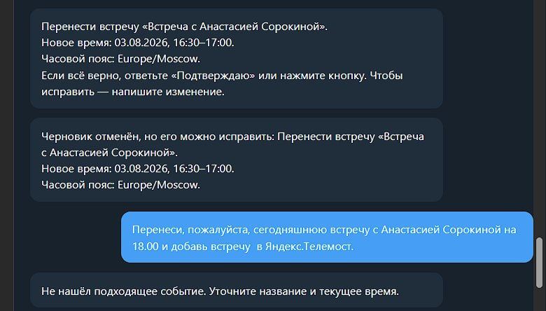

# UMEC AI Planner

Self-hosted семейный AI-планировщик: календарь, почта, задачи, таймеры, голосовые команды и видеовстречи в одном приватном пространстве.

[Сайт и инструкция](https://tigramaan.github.io/ai-planner/) · [Быстрый запуск](#быстрый-запуск) · [Skill для агента](skills/deploy-aiplanner/SKILL.md) · [Security](docs/THREAT_MODEL.md)



## Что умеет

- текстовый и голосовой чат на русском и английском;
- задачи со сроками, приоритетами, поиском, фильтрами и завершением;
- Today и Week с локальными задачами и внешними календарями;
- создание, изменение и удаление встреч только после подтверждения;
- Google Calendar, Contacts и Gmail;
- Microsoft Outlook, Contacts и Teams;
- Zoom и постоянные ссылки Яндекс Телемоста;
- push-напоминания и PWA для iPhone/Android;
- отдельный аккаунт, OAuth-токены, настройки и история для каждого участника;
- одноразовые семейные инвайты и защита от BOLA.

## Быстрый запуск

Требуются Linux-сервер, Docker Compose, домен с DNS-записью на сервер и открытые порты 80/443.

```bash
git clone https://github.com/tigramaan/ai-planner.git
cd ai-planner
cp .env.example .env
mkdir -p .secrets
openssl rand -base64 32 > .secrets/vapid_private.pem
docker compose --profile caddy up -d --build
docker compose ps
```

Перед запуском замените все `replace-with-*` в `.env`. Генерируйте секреты локально:

```bash
openssl rand -hex 32                         # JWT_SECRET / WORKER_SERVICE_TOKEN
openssl rand -base64 32                      # SECRET_MASTER_KEY
openssl rand -base64 24                      # POSTGRES_PASSWORD
```

Никогда не публикуйте `.env`, OAuth client secrets, private keys, backup-файлы или реальные токены. `.gitignore` уже исключает их.

## Подключения

| Сервис | Что подготовить | Callback |
|---|---|---|
| OpenAI | API key и лимит расходов | не требуется |
| Google | OAuth Web client; Calendar, People, Gmail API | `/api/v1/integrations/google/oauth/callback` |
| Microsoft | Entra Web app и delegated permissions | `/api/v1/integrations/microsoft/oauth/callback` |
| Zoom | General App OAuth | `/api/v1/integrations/zoom/oauth/callback` |
| Яндекс 360 | service app для организации; CalDAV/IMAP/SMTP | зависит от организации |

Полная пошаговая настройка находится на [GitHub Pages](https://tigramaan.github.io/ai-planner/#install) и в [справочнике skill](skills/deploy-aiplanner/references/providers.md).

## Установка через AI-агента

Передайте Codex или Claude Code репозиторий и попросите использовать `skills/deploy-aiplanner/SKILL.md`. Навык проверит сервер, поможет создать `.env`, по одному запросит provider credentials, запустит Compose и выполнит smoke/security checks. Агент не должен печатать или коммитить секреты.

Claude Code здесь поддерживается как агент установки и разработки. Runtime-команды планировщика сейчас обрабатывает OpenAI Responses API. Поддержка Anthropic Claude как runtime-provider — хороший отдельный contribution.

## Архитектура

```text
Browser / PWA → Web (Next.js) → API (FastAPI) → PostgreSQL
                                  ↓              Redis → Worker → Web Push
                         Google / Microsoft / Zoom
```

Токены интеграций зашифрованы AES-256-GCM; внешние действия проходят immutable pending action и явное подтверждение; сервисы запускаются non-root. Контракты и требования находятся в `contracts/` и `specs/`.

## Проверка

```bash
.venv/bin/ruff check services/api
.venv/bin/pytest services/api
npm run worker:test
npm run web:test
npm run web:build
node tools/guards/check-file-lines.mjs
```

История репозитория проверяется Gitleaks. Запустите локально:

```bash
docker run --rm -v "$PWD:/repo" zricethezav/gitleaks:latest git /repo --redact
```

## Хотите помочь?

Проект открыт для contributors. Особенно нужны:

- runtime-provider для Anthropic Claude;
- Ollama и другие OpenAI-compatible локальные модели;
- YandexGPT и навык Алисы;
- GigaChat и голосовые ассистенты Сбера;
- новые календарные/почтовые коннекторы;
- мобильное тестирование, локализация и accessibility.

Откройте issue с предложением, затем небольшой PR с тестами и обновлением спецификаций. Если хочется «довайбкодить» свой provider — берите существующий adapter как контрактный пример и не передавайте модели OAuth-токены или пользовательские секреты.

## Лицензия

Перед публичным распространением выберите и добавьте файл `LICENSE`. До этого применяются стандартные авторские права владельца репозитория.
